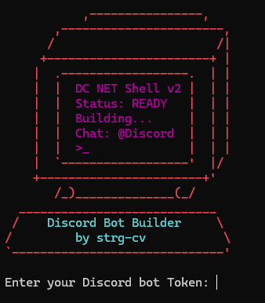

# Discord Bot Builder

A Python-based Discord bot generator that allows system monitoring, automation, and remote command execution. This project is intended for **educational purposes** and should only be used on computers you own or have explicit permission to access. **Unauthorized use is illegal.**

---

## Features

### SYSTEM & INFO
- `!systeminfo` → Shows system information (CPU, RAM, Disk, IP, Processor, etc.)  
- `!listprocess` → Lists all running processes with PID and name  
- `!admincheck` → Checks if the bot has admin privileges on the PC  
- `!grabtokens` → Collects Discord tokens on the PC  

### FILES & EXECUTION
- `!cmd <command>` → Executes any shell/terminal command  
- `!delete <path>` → Deletes a file from the computer  
- `!download <URL>` → Downloads a file from the internet  
- `!upload` → Saves files uploaded in the Discord channel  

### SCREENSHOTS & CLIPBOARD
- `!screenshot` → Takes a screenshot of the screen  
- `!clipboard` → Shows the current clipboard content  

### TYPING & SPEECH
- `!write <text>` → Automatically types text on the PC  
- `!voice <text>` → Speaks the text aloud using TTS (pyttsx3)  

### NETWORK & LOCATION
- `!geolocate` → Provides geographic location based on public IP  

### USER INTERACTION
- `!message <text>` → Shows a popup window with a message  
- `!wallpaper` → Changes the desktop wallpaper (if an image is attached)  

### MISC
- `!stop` → Stops the bot and exits the script  

---

## How to Get Started

### 1. Create a Discord Bot
- Go to the [Discord Developer Portal](https://discord.com/developers/applications).  
- Click **New Application → Bot → Add Bot**.  
- Copy the **Bot Token** (keep it secret!).

### 2. Invite the Bot to Your Server
- Use **OAuth2 → URL Generator → bot** scope, set permissions, open generated URL, and add bot to your server.

### 3. Get Your Channel ID
- Enable **Developer Mode** in Discord settings.  
- Right-click your channel → **Copy ID**.  

### 4. Run the Bot Generator
```bash
git clone https://github.com/yourusername/discord-bot-builder.git
cd discord-bot-builder
python bot_generator.py
